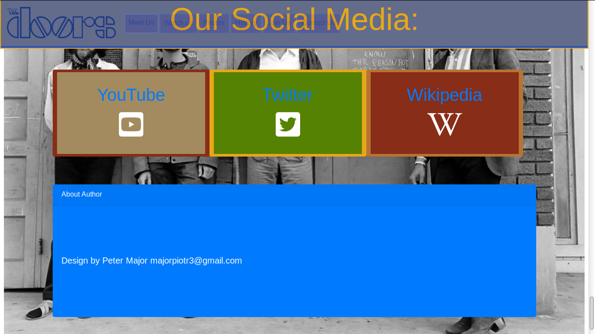

# the-doors
> Let's Talk About Project.
> It’s my 1st software developer Project
## What it is?
It is my 1st project for **Code Institute** bootcamp. It is front-end only web page about **The Doors** – rock band from 60’ . 


Image of 1st section

## Technologies that I used
For this project I used :
- **Bootstrap** – CSS framework https://getbootstrap.com/
- **Jquery** – JS library https://jquery.com/
- **Fontawesome** – Library for Icons. https://fontawesome.com/
- **GIMP** - for making graphics and mocking-up (are in xcf files) https://www.gimp.org/

## Installation

This version does **not required** installation.
	
In order to start webpage open file **index.html** in web browser (eg. Mozilla,Safari,Chrome,Opera).


>I strongly recomend using Nexus web browser https://en.wikipedia.org/wiki/WorldWideWeb
>- It was Joke


Index file (in green area)

## Target group
Of course page is design for fun's of **‘The Doors’**.  
Since **The Doors** is from 60’, oldest users could be even between 70 - 100 years old.
It means that it is good idea to think about older users during making this project. 
This is why I made some css and js classes that make page easier to use it for older people (such as **easy_read** and **zoomable** mentioned in following sections of this document.).

However **“The doors”** is still very popular and has significant impact on music nowadays.
This is why in video player you can find **“Sampled In“**, **“Interpolated By”** and **“Cover By”** sections. It shows how **The Doors** influenced today's  music.

I used many ideas that I found out in other web pages and **awwwards.com** , such as photo background, animations and scrolling control. I think page looks modern and professional .  
On the other side – **“The Doors”** is rock band from 60’ and therefore I used colors from these years.     


## Usage
Open **index.html** file. By mouse scrolling you will run animation and section with information about **The Doors**
### Top menu
You can also use menu on top to jump to section that interested you the most. In order to do this you have to hover top menu (the element on very top of screen, normally is a little bit transparent).
When you click on name of section, the section will appear on your screen.


When menu is not hovered is a little bit transparent


When you hover menu it will be not transparent anymore, so you will see all buttons


Selected option will change background color to white, font to black and become bigger. Its siblings will turn  and become smaller

### Backgrounds
After section will be fully loaded you will see **photo background only**. 
This solution allows you to see everything on photo, because other elements don’t hide the photo content.
### Animations
After **scrolling mouse** you will see animations of appearing section contentment- I made many css animations classes that you see in **/css/css** file, however I use mostly **wake-up** class. 
Elements are **“waking up”** -from bottom of pages and are growing a little bit.  
I think it looks nice especially alongside with photo-background.

### Hovering, zooming and easy_read
#### Zoomable

Example of using zoomable class on photo


Thanks to **zoomable** class hovering on each element makes it bigger so it improve user experience. 
Classes are in **css/style.css** file under comment:

```css
/* class zoomable - it allows us to zoom element.
```

I prepared 4 clases:
* **zoomable**, it makes element 10% bigger
* **zoomable-150**, it make element even bigger
* **zoomable-150**, it make element even bigger
* **zoomable-200**, it makes element 2 times bigger

#### Easy_read


Example of **zoomable** and **easy_read** class

When you hover on text – the background of text become white and text become black. I hope it makes text more visible and can be helpful – especially for older people that can not see very well. As we know **The Doors** is rock band from 60’ so it is likely that someone that is 70-100 years old can use this webpage, usually  people in this age like texts that are easy to read.
Class easy_read is in **css/style.css** file under:

```css
/*
Easy read- it changes colors to black and white when hover in order to make text easier to read
*/
.easy_read:hover
{
  color:black;
  background-color: white;
}
```


### Colors 


* Colors used on project

Web page uses colors that were popular in 60’ , particularly :
* **burn_sienna** (#882D17)
* **harvest_gold** (#E6A817)
* **avocado** (#568203)
* **teak** 	(#A38B5F)
* **cerulean_blue** (#2a52be)
* **coppertone** (#b87333)

The information's about colors I got from this web page: https://juiceboxinteractive.com/blog/color/ 


## 1st section “Meet us”


Image of 1st section

First section is presentation of **The Doors** members therefore I call this section **meet us**. 
Here you can see their photos, position in team  and short text about each of them. Hovering photos shows you alternative photo. Hovering on text makes it easy to read. 


### Small siblings 
When you hover one of card the siblings cards will be 3d rotate, each in other direction thanks to class **.small** siblings, js functions from **js/script.js** file and many css classes made by me.

Js functions are available in file **js/script.js** bellowed commend  :  
```javascript
//  Set of 3d animations that affect siblings of hovered element
```
css functions are available in file **css/style.css**. Example bellowed  :
```css
/* makes smaller the element that is sibling of hovered element and is on most left  */
.smallable_3d_most_left
{
 -webkit-transform-style: preserve-3d; /* Safari 3-8  */    
    -webkit-transform: rotateY(80deg) scale(0.9); /* Safari 3-8  */
    transform-style: preserve-3d;
    transform: rotateY(80deg);
}
```

### Moving background
Photo background of this section is moving from left to right and then back, thanks to css class **background-move** in **css/style.css**.
```css
@keyframes  backgound-move
{
    /*
    Animation moves background from LEFT to RIGHT and then again to START point on LEFT side
    It aplies to every section 
    */
    0% {
      background-position: 0%;
    }
    50% {
      
      background-position: 100%;
    }
    100%{
      background-position: 0%;   
    }
}
```


### Photos
I downloaded those photos from internet, removed background in **GIMP** and export to **.png** file. Therefore they are transparent.
## 2nd section “Our videos”


Image of 2st our wideos


I prepared video player that uses videos from **youtube**. You can watch clips of the doors and read extra informations about songs.  
On left side (top for smartphones) you can chose song. Each button is **zoom-able** and has class **easy_read**. Hovering menu makes it larger and makes video player smaller. 

On right side (bottom for smartphones) you can find video player as well as links to **wikipedia** (more informations about song) and **songfacts.com**  (lyrics and interested facts), all links will open in new tab/window of your web browser.
Bellowed this is table with informations and links about song – who is songwriter, release date and many more. Hovering column  of this table change photo on very right side. For example when you hover “Written By:” column you will see photo of song writer (next to table). 
* Clicking this photo opens it in modal, so you can see this in full-screen mode.  

* Buttons previous and next on right and left side of player  load next or previous song when you click at them. 

All video player,menu and scripts are written by me, however I would like change this to script that uses back-end  (likely **joomla php** is the best solution for this ) 
Code of videoplayer is in **js/script.js** file under comment:
```javascript
// Function for control video section
```

## 3th section  “Photos”


Image of 3st our photos

Here you can see some photos of **‘The Doors’**, hovering one of them changes photo background of section and hides sibling photos. 
I think that this way of presenting photos is more suitable for older audience with no very excellent IT skills.  Moreover  using this alongside with moving background makes nice visual effect.  
All gallery functions you can find in **js/script.js** file under:
```javascript
// functions for photo gallery
```


Image of 3st our photos

## 4 th section “Our History”

Image of 4st our history

In this section I present history of **“The Doors”**. It works similar to video player  , however instead of video it uses text. I am not very familiar with history of music so  I copied parts of articles about **The Doors**  from **Wikipedia**.

## 5th section “Next Event”

Image of 5st next event

Here you can find 2 card- left one is for calendar and right one is for presentation of next event.
It does not works because it would required some back end, however it is not problem to put there standard **Joomla** extensions with calendar. 
Hovering one card make it bigger and makes smaller its sibling . 

## 6th section “Our Social Media”

Image of 6st our social media

Here you can find links to:
* **youtube** Chanel of **The Doors** 
* **twitter** about **The Doors** 
* **wikipedia** page about them

On very bottom part of the page is cart with my name and mail, I would like to put there also link to my personal page , but it is not ready now. 

## Mocking-up
I used **GIMP** for mocking-up project, because I am familiar with this software and it is availabe for Linux. 
I think **basamiq** could be ok, but
* has very limited options, comparing to https://moqups.com/ and other commercial solutions
* is not free - free version has some limitations
* is not availabe for **linux** (wine version only)

Chosing gimp alowed me to mock-up project quite fast.
Here you can see all **png** images of mock-up:

Page 1


Page 2


Page 3


Page 4


Page 5


Page 6
* All mock-up files (**.png** and  **gimp .xfc**) are in forder : **mock_up** 

## What next?
I am not sure if I am going to work on this project after I submit this, but if yes, I would like to :
### Joomla/Drupal 

My idea is to change this to **Joomla** page. It would be nice to have some back-end abilities, such as comments, calendar and adding articles. Right now it is only html/css/js page, so it is useless. However, I don’t think it makes sens to use sophisticated frameworks such as **Django**, **Flask** or **Laravel** here. Using ready **CMS** such as **Wordpress**, **Drupal** or **Joomla** keeps this simply and easy to admin. I have some experience with **Joomla**, but never made anything big, so I think it would be good idea for me to use this technologies here. Moreover I am sure that this web page would use very various contend – videos , photos, users , music and for this **Joomla** could be better choose than **Wordpress** because It was designed for sharing many kind of content.

###  The Doors official web page

Maybe contact admin of **The Doors** official web page and work together would be good idea? I am consider this, but because of lack of time it is not possible now.


## Author
    • Peter Major  - majorpiotr3@gmail.com
